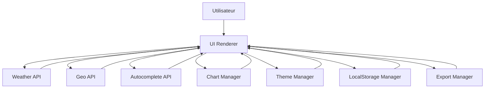

# WeatherApp 🌤️

Application météo moderne et professionnelle offrant des prévisions précises, une interface intuitive et des fonctionnalités avancées pour une expérience utilisateur optimale.

---

## ✨ Fonctionnalités

- 🔍 Recherche de ville avec autocomplétion
- 🌡️ Données météo détaillées (température, humidité, vent, pression)
- 📊 Graphiques interactifs (Chart.js)
- 🌙 Mode sombre / clair / automatique
- 📌 Historique des recherches (LocalStorage)
- 📍 Géolocalisation automatique
- 💾 Export des données (JSON, CSV, PDF)
- 📱 Design responsive (mobile, tablette, desktop)
- ♿ Accessibilité conforme WCAG 2.1

---

## 📂 Structure du projet

```
weather-app/
│
├── index.html
│
├── css/
│   ├── main.css
│   ├── components/
│   │   ├── header.css
│   │   ├── search.css
│   │   ├── weather-card.css
│   │   ├── charts.css
│   │   └── history.css
│   ├── themes/
│   │   ├── light.css
│   │   ├── dark.css
│   │   └── transitions.css
│   └── responsive.css
│
├── js/
│   ├── app.js
│   ├── vendors/
│   │   └── chart.min.js
│   └── modules/
│       ├── api/
│       │   ├── weatherApi.js
│       │   ├── geoApi.js
│       │   └── autocompleteApi.js
│       ├── ui/
│       │   ├── renderer.js
│       │   ├── themeManager.js
│       │   ├── loader.js
│       │   └── notifications.js
│       ├── storage/
│       │   └── localStorageManager.js
│       ├── charts/
│       │   └── chartManager.js
│       ├── export/
│       │   ├── jsonExporter.js
│       │   ├── csvExporter.js
│       │   ├── pdfExporter.js
│       │   └── exportManager.js
│       └── utils/
│           ├── validators.js
│           ├── formatters.js
│           └── errorHandler.js
│
├── assets/
│   ├── icons/
│   │   ├── weather/
│   │   │   ├── clear.svg
│   │   │   ├── clouds.svg
│   │   │   ├── rain.svg
│   │   │   ├── drizzle.svg
│   │   │   ├── thunderstorm.svg
│   │   │   ├── snow.svg
│   │   │   └── mist.svg
│   │   └── ui/
│   └── animations/
│       └── loader.json
│
└── config/
    └── api.config.js
```

---

## 🚀 Technologies utilisées

- **HTML5 / CSS3**
- **JavaScript (ES6+)**
- **Chart.js** (visualisation des données)
- **jsPDF** (export PDF)
- **OpenWeatherMap API** (données météo)
- **LocalStorage** (persistance des recherches)

---

## 🛠️ Installation

1. Clonez le repository :
   ```bash
   git clone https://github.com/votre-username/weather-app.git
   ```

2. Accédez au dossier du projet :
   ```bash
   cd weather-app
   ```

3. Ouvrez `index.html` dans votre navigateur ou servez le projet avec un serveur local (ex. `Live Server` dans VS Code).

---

## 📖 Utilisation

- Entrez le nom d’une ville dans la barre de recherche.  
- Consultez les prévisions météo détaillées et les graphiques interactifs.  
- Activez le mode sombre ou clair selon vos préférences.  
- Exportez vos données en JSON, CSV ou PDF.  

---

## 📌 Schéma d’architecture



---

## 🤝 Contribuer

1. Forkez le projet.  
2. Créez une branche (`git checkout -b feature/ma-fonctionnalite`).  
3. Commitez vos modifications (`git commit -m 'Ajout d’une nouvelle fonctionnalité'`).  
4. Poussez la branche (`git push origin feature/ma-fonctionnalite`).  
5. Ouvrez une Pull Request.  

---

## 📜 Licence

Ce projet est sous licence MIT. Vous êtes libre de l’utiliser, le modifier et le distribuer.
